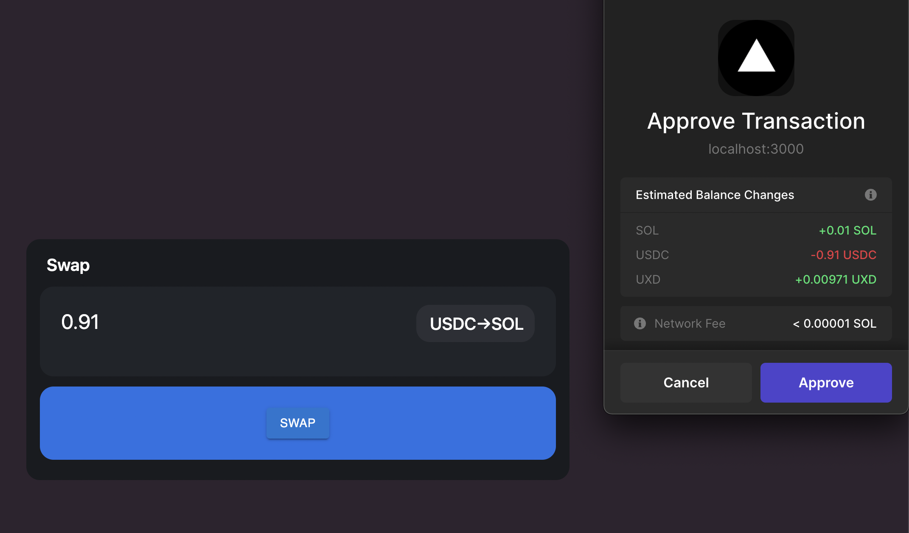

# UXDEX

## What is UXDEX

UXDEX とは {BTC, ETH, SOL} <-> USDC ペアに対応した DEX

我々は UXD protocol を OTC 取引所としてみなすことができるという発想から，[UXD Protocol](https://uxd.fi/)と[Saber Protocol](https://app.saber.so/#/swap)と接続することで BTC-USDC，ETH-USDC，SOL-USDC の DEX を実装した．

## Base Protocols

<dl>
  <dt> <a ref="https://uxd.fi/">UXD Protocol</a> </dt>
  <dd>無期限先物でヘッジした合成ポジション（いわゆるデルタニュートラルポジション）を担保にステーブルコイン UXD を発行するプロトコル</dd>
  <dt><a ref="https://app.saber.so">Saber Protocol</a></dt>
  <dd>ステーブルスワッププロトコルで，UXD-USDC ペアが存在．Ethereum で言うところの<a ref="https://curve.fi">Curve Protocol</a></dd>
</dl>

## Core Concepts

### UXD protocol を OTC 取引所としてみなす……とは？

UXD protocol はデルタニュートラルポジションを担保にステーブルコインを発行するプロトコル．担保であるデルタニュートラルポジションは現物の価格によらずドル建てで価値を一定に保つ．

例)

1. 1 SOL = 100 USD のときに，Alice は 1 SOL を担保に 100 UXD を発行（Protocol は裏で 1SOL の先物売りポジションを構成）
2. Alice は 100 UXD をよしなに運用する
3. 1 SOL = 200 USD のときに，Alice は 100 UXD を償還して担保を回収．（Protocol は裏で先物売りポジションを解体）このとき回収される担保は **0.5 SOL**となり，残りの 0.5 SOL は先物売りポジションの損失にあてられる．

例からわかるように，UXD は DAI などのいわゆる担保型ステーブルコインとは全く違う性質を示す．DAI は現物のみを担保にしているので価格上昇の恩恵を受けるが，UXD は現物 **+先物売りポジション** の合成ポジションを担保にしているので価格上昇の恩恵を受けることができない．（逆に価格下落時の清算が UXD には発生しない）

上記の例を Alice の視点から観察すると **1.では 1 SOL を市場価格で売却していることに等しく，3.では 1 SOL を市場価格で購入していることに等しい**． これが UXD protocol を OTC 取引所としてみなすことができる理由である．

## Features

この OTC 取引所の長所は**取引額が大きくなっても(Uniswap などの AMM DEX と比較して)スリッページが大きくなりにくい**点です

現段階では,USDC→SOL の swap にのみ対応しています．

具体的には Saber Protocol と UXD Protocol にてそれぞれ提供されている USDC→UXD と UXD→SOL の swap それぞれの Instructions を結合した Transaction を構成しています．

これによりユーザーは直接的な USDC→SOL の交換ができます.

## 苦労した点

UXD Protocol はクローズドソースなので，実際にメインネット上で Tx を発行し，リバースエンジニアリングする必要がありました．

条件を変更した Tx を何個も発行し，UXD Protocol のデータエンコーディングや Account inputs を理解していくのに時間と苦労を要しました．

# Demo

# 対応ウォレット

- Phantom
- Solflare
- Torus
- Ledger
- Sollet
- Slope
- Sollet(Extension)
